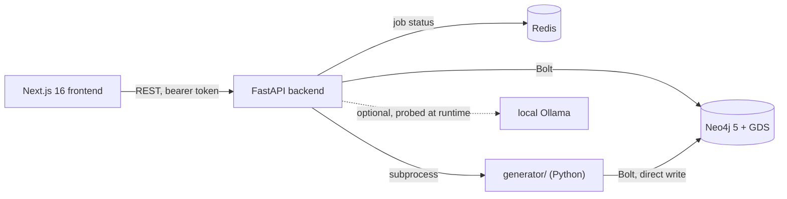

# ARGUS

A graph-native investigation and analytics platform built entirely on procedurally generated synthetic data.

ARGUS models a **global operating picture**: 70 real cities across 50 countries and 10 regions, with real coordinates and real trade geography. Every person, organization, phone number, account, transaction, shipment, and document inside it is **100% synthetic**. No real individual or real company is represented. There is no scraping, no OSINT, and no surveillance functionality — this is an engineering demonstration of graph database design, graph analytics, and investigation-workflow tooling.

South Asia is the heaviest-weighted region by design — it is the declared **area of interest**, not the whole world model. An analyst moves World → Region → Country → City → Entity → Relationship → Event → Case, and the application preserves that context across the graph, map, search and case surfaces.

`ARGUS_PLAN.md` in this repository is the original pre-build design proposal — architecture rationale and phase-by-phase reasoning, kept for historical context. **The `docs/` directory below is the current, maintained source of truth** for how the system actually works.

## What this is

An analyst-facing tool for exploring a connected dataset of people, organizations, accounts, devices, vehicles, and their relationships: search and profile any entity, explore the graph interactively, run graph algorithms (PageRank, community detection, cycle detection, ML-based anomaly detection) against the live data, manage investigations as cases with an evidence board, and review system-generated alerts. A Scenario Generator can inject new, realistic investigation storylines into the live graph on demand, using the same generation engine that built the world.

## Key capabilities

- **Command Center** — one workspace rather than a card grid: a situation statement in prose before any figure, a regional strip that *filters* the queue beside it, and a master-detail lead panel that answers "why am I seeing this" from the scorer's own recorded factors, the alerts and cases already referencing the entity, and its real connections.
- **Graph Explorer** — Cytoscape.js canvas over the live Neo4j graph. Opens on a risk-led overview rather than the whole graph; entity type and risk are encoded as independent channels (fill vs. border ring); labels are gated by zoom and importance; focus mode isolates a neighborhood; clicking an edge explains *why* two entities are connected. Plus neighborhood expansion, shortest-path finding, and multiple layouts.
- **Analytics Engine** — PageRank, Betweenness, Louvain communities, Node2Vec similarity, custom risk propagation, and cycle detection via Neo4j Graph Data Science; plus Isolation Forest + z-score transaction-anomaly detection that independently rediscovers injected anomalies without reading their ground-truth labels.
- **Cases & Alerts** — alerts are a triage workspace where the queue selects and the detail argues: what happened, why it matters, what is affected, where it spreads (distinct countries and regions across the involved entities), and which other alerts share its storyline. A case opens with its footprint — reach across countries and regions, plus the alerts involving anything on its evidence board.
- **Local Intelligence Layer** — deterministic, template-composed entity/case narratives (no model, no network call), plus an entirely optional local-LLM assistant that the rest of the product has zero dependency on.
- **Scenario Generator** — creates a new synthetic investigation storyline on demand by running the real generation engine as a background job against the live graph.
- **Map** — a global geospatial workspace (MapLibre + deck.gl) with three scale tiers that swap datasets rather than restyle one: regions and trade corridors at world zoom, country aggregates at regional zoom, individual entities and shipment routes locally. Routes and the ranked context panel scope to the visible extent, so drilling in actually narrows what you see. Clicking a flagged route explains *why* it was flagged.
- **Timeline** — a temporal investigation workspace: daily volume with burst detection (days above 2σ of flagged volume), time-range and per-lane filters, and a ranked panel of what actually happened inside the current selection.

See [docs/analytics.md](docs/analytics.md) and [docs/ai-layer.md](docs/ai-layer.md) for how these actually work.

## Architecture at a glance



No hosted AI dependency anywhere in ARGUS Core — every "intelligence" feature is a graph algorithm, a classical ML model trained fresh on ARGUS's own synthetic data, or a deterministic template composer. The one optional LLM surface talks only to a local Ollama instance you run yourself. Full rationale: [docs/architecture.md](docs/architecture.md#local-first--no-hosted-ai-dependency).

## Technology stack

| Layer | Technology |
|---|---|
| Frontend | Next.js 16 (App Router), TypeScript, vanilla CSS Modules, Cytoscape.js, MapLibre GL + deck.gl, @visx/Recharts, TanStack Query, Zustand, Framer Motion |
| Backend | FastAPI (Python 3.12), async Neo4j driver, async Redis client |
| Database | Neo4j 5 Community Edition + Graph Data Science (GDS) plugin, self-hosted via Docker |
| Data generation | Python + Faker (per-region locales), deterministic/seeded |
| Intelligence | Neo4j GDS algorithms, scikit-learn (Isolation Forest), deterministic template NLG; optional local LLM via Ollama |

## Repository layout

```
argus/
├── ARGUS_PLAN.md       # Original design proposal — historical rationale
├── docs/                # Current technical documentation (start here)
├── docker-compose.yml   # Neo4j+GDS, Redis, backend
├── backend/             # FastAPI app
├── frontend/            # Next.js app
└── generator/           # Synthetic data generation engine (own venv)
```

## Running locally

```bash
cp .env.example .env

docker compose up -d neo4j redis   # graph database (with GDS) + cache

cd generator
python3 -m venv .venv && source .venv/bin/activate
pip install -r requirements.txt
export NEO4J_PASSWORD=argus_dev_password   # credentials come from the env, never argv
python3 generate_world.py --seed 42        # populates the graph (~20K nodes, ~90K relationships, ~15s)

cd ../backend
python3 -m venv .venv && source .venv/bin/activate
pip install -e ".[dev]"
uvicorn app.main:app --reload   # or: docker compose up -d backend

cd ../frontend
npm install
npm run dev
```

- Frontend: http://localhost:3000
- Backend API docs: http://localhost:8000/docs
- Neo4j Browser: http://localhost:7474

> Keep `generator/.venv` in place after initial world generation — the Scenario Generator (`/scenario` page) invokes it directly as a subprocess. See [docs/deployment.md](docs/deployment.md).

## Configuration

Every environment variable, its default, and what it affects is documented in [docs/deployment.md](docs/deployment.md#environment-variables). Copy `.env.example` to `.env` and adjust as needed; the defaults work out of the box for local development.

## Development workflow

- Backend: `ruff check .` / `mypy app` / `pytest` from `backend/` (dev extras: `pip install -e ".[dev]"`).
- Frontend: `npm run lint`, `npx tsc --noEmit`, `npm run build` from `frontend/`.
- `make lint` / `make typecheck` / `make test` run the equivalent checks from the repo root.
- GitHub Actions (`.github/workflows/ci.yml`) runs all of the above on every push and PR to `main`.
- No schema migration tool — the Neo4j schema (constraints, indexes) is created idempotently by the generator on every run; see [docs/database.md](docs/database.md).
- See [docs/backend.md](docs/backend.md#adding-a-new-endpoint) and [docs/generator.md](docs/generator.md) for where to add new endpoints or storyline types.

## Production considerations

ARGUS is local-first by design, built for a single analyst on one machine. It intentionally does not implement multi-tenant auth, a durable job queue, or hosted deployment — see [docs/deployment.md](docs/deployment.md#what-would-need-to-change-for-a-real-multi-tenanthosted-deployment) for exactly what those would require.

## Documentation index

| Document | Covers |
|---|---|
| [docs/architecture.md](docs/architecture.md) | System boundaries, request/job flows, key design decisions |
| [docs/backend.md](docs/backend.md) | FastAPI structure, services, background jobs, DI |
| [docs/frontend.md](docs/frontend.md) | Next.js routes, hooks, state management, Graph/Map/Timeline internals |
| [docs/database.md](docs/database.md) | Neo4j labels, relationships, indexes, schema rationale |
| [docs/api.md](docs/api.md) | Every HTTP endpoint |
| [docs/generator.md](docs/generator.md) | World generation pipeline + on-demand scenario injection |
| [docs/analytics.md](docs/analytics.md) | Every graph algorithm, anomaly detection, case/alert workflow |
| [docs/ai-layer.md](docs/ai-layer.md) | Template narratives + the optional local-LLM assistant |
| [docs/deployment.md](docs/deployment.md) | Running locally, Docker, every environment variable |
| [docs/troubleshooting.md](docs/troubleshooting.md) | Common failure modes and fixes |
| [ARGUS_PLAN.md](ARGUS_PLAN.md) | Original design proposal (historical) |

## Keyboard shortcuts

| Shortcut | Action |
|---|---|
| `⌘K` / `Ctrl+K` | Open the command palette — filterable jump-to-any-page |
| `⌘J` / `Ctrl+J` | Open Ask ARGUS (only appears if a local Ollama instance is detected) |
| `Escape` | Close whichever overlay (command palette, modal) is open |

## Ethics note

ARGUS contains no real personal data, no scraped data, and no surveillance functionality of any kind. Every entity, relationship, shipment and event is procedurally generated and fictional. Real geography — city names, coordinates, country dialing codes, corporate legal forms, trade corridors — is used only to ground the synthetic world in plausible places, so that a generated dataset reads coherently to an analyst. No real individual or organization is represented, and nothing here describes real events.
