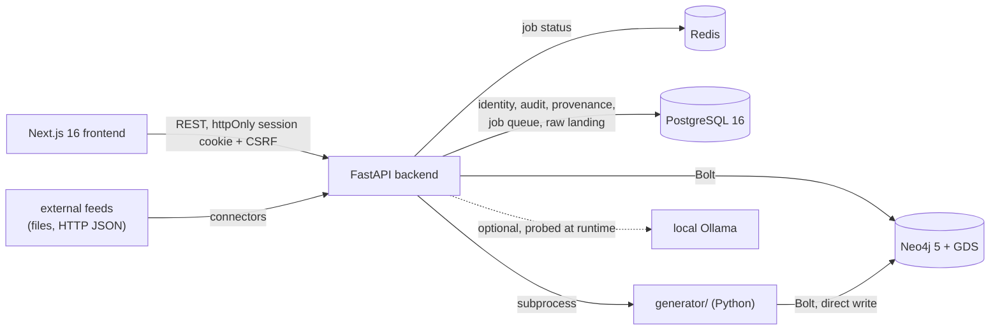

# ARGUS

A graph-native investigation and analytics platform built entirely on procedurally generated synthetic data.

ARGUS models a **global operating picture**: 70 real cities across 50 countries and 10 regions, with real coordinates and real trade geography. Every person, organization, phone number, account, transaction, shipment, and document inside it is **100% synthetic**. No real individual or real company is represented. There is no scraping, no OSINT, and no surveillance functionality — this is an engineering demonstration of graph database design, graph analytics, and investigation-workflow tooling.

South Asia is the heaviest-weighted region by design — it is the declared **area of interest**, not the whole world model. An analyst moves World → Region → Country → City → Entity → Relationship → Event → Case, and the application preserves that context across the graph, map, search and case surfaces.

`ARGUS_PLAN.md` in this repository is the original pre-build design proposal — architecture rationale and phase-by-phase reasoning, kept for historical context. **The `docs/` directory below is the current, maintained source of truth** for how the system actually works.

## What this is

An analyst-facing tool for exploring a connected dataset of people, organizations, accounts, devices, vehicles, and their relationships: search and profile any entity, explore the graph interactively, run graph algorithms (PageRank, community detection, cycle detection, ML-based anomaly detection) against the live data, manage investigations as cases with an evidence board, and review system-generated alerts. A Scenario Generator can inject new, realistic investigation storylines into the live graph on demand, using the same generation engine that built the world.

## Key capabilities

- **Command Center** — one workspace rather than a card grid: a situation statement in prose before any figure, a regional strip that *filters* the queue beside it, and a master-detail lead panel that answers "why am I seeing this" from the scorer's own recorded factors, the alerts and cases already referencing the entity, and its real connections.
- **Graph Explorer** — Cytoscape.js canvas over the live Neo4j graph. Opens on an assessment-led overview rather than the whole graph; entity type and ARGUS's assessment band are encoded as independent channels (fill vs. border ring); labels are gated by zoom and importance; focus mode isolates a neighborhood; clicking an edge explains *why* two entities are connected. Plus neighborhood expansion, shortest-path finding, and multiple layouts.
- **Analytics Engine** — PageRank, Betweenness, Louvain communities, Node2Vec similarity, custom risk propagation, and cycle detection via Neo4j Graph Data Science; plus Isolation Forest + z-score transaction-anomaly detection that independently rediscovers injected anomalies without reading their ground-truth labels.
- **Cases & Alerts** — every alert is raised by a named, versioned rule from ARGUS's own assessments and correlations, and says which rule, on what evidence, how many times it has fired, and why it sits where it does in the queue. Re-running the rules over an unchanged world increments an occurrence count rather than adding a row. Alerts group by the correlated cluster their subjects belong to, every state change is attributed and kept, dismissal requires a reason from a fixed vocabulary, and a suppression hides an alert from the default queue without ever preventing it being raised. A case opens with its footprint — reach across countries and regions, plus the alerts naming anything on its evidence board.
- **Provenance & confidence** — every displayed value resolves to the source that reported it, or is explicitly marked *inferred*, *modified* or *unattributed*. Sources carry Admiralty reliability (A–F) and claims carry credibility (1–6), kept as two independent readings and never averaged into one figure. Contradictory claims render side by side with no automatic winner, and "what did ARGUS believe on date D" is answerable. The synthetic data generator is itself a registered source, flagged as such, so generated ground truth can never be mistaken for discovered intelligence.
- **Ingestion** — a connector framework where adding a *source* is a database row and adding a *kind* of source is one class. Records land raw and hash-keyed before anything interprets them, so re-reading a file creates no duplicate and a wrong mapping can be corrected and replayed. Anything rejected goes to an inspectable dead-letter queue with the stage and reason — never silently dropped, because a silent drop makes a collection gap invisible. A feed that stops producing within its own declared interval is reported, since a silent source otherwise looks exactly like a quiet world. Runs are durable queued jobs in PostgreSQL, so a restart postpones a batch rather than losing it.
- **Entity resolution** — when two records describe the same real thing, ARGUS says so *reversibly*. A merge is an append-only claim about two records, never an edit to either, so both survive untouched and un-merging costs nothing. The matcher acts alone only where an identifier matched exactly and nothing disagreed; everything else goes to an analyst with every attribute compared side by side — including the ones that could not be compared, because a missing value is neither agreement nor disagreement. Scores are never shown without the share of evidence that produced them. When merges imply an identity that other decisions contradict, the cluster is marked contested and left for a person rather than quietly resolved.
- **Local Intelligence Layer** — deterministic, template-composed entity/case narratives (no model, no network call), plus an entirely optional local-LLM assistant that the rest of the product has zero dependency on.
- **Scenario Generator** — creates a new synthetic investigation storyline on demand by running the real generation engine as a background job against the live graph.
- **Map** — a global geospatial workspace (MapLibre + deck.gl) with three scale tiers that swap datasets rather than restyle one: regions and trade corridors at world zoom, country aggregates at regional zoom, individual entities and shipment routes locally. Routes and the ranked context panel scope to the visible extent, so drilling in actually narrows what you see. Clicking a flagged route explains *why* it was flagged.
- **Timeline** — a temporal investigation workspace: daily volume with burst detection (days above 2σ of flagged volume), time-range and per-lane filters, and a ranked panel of what actually happened inside the current selection.

See [docs/analytics.md](docs/analytics.md) and [docs/ai-layer.md](docs/ai-layer.md) for how these actually work.

## Architecture at a glance



No hosted AI dependency anywhere in ARGUS Core — every "intelligence" feature is a graph algorithm, a classical ML model trained fresh on ARGUS's own synthetic data, or a deterministic template composer. The one optional LLM surface talks only to a local Ollama instance you run yourself. Full rationale: [docs/architecture.md](docs/architecture.md#local-first--no-hosted-ai-dependency).

## Technology stack

| Layer | Technology |
|---|---|
| Frontend | Next.js 16 (App Router), TypeScript, vanilla CSS Modules, Cytoscape.js, MapLibre GL + deck.gl, @visx/Recharts, TanStack Query, Zustand, Framer Motion |
| Backend | FastAPI (Python 3.12), async Neo4j driver, async Redis client |
| Database | Neo4j 5 Community Edition + Graph Data Science (GDS) plugin, self-hosted via Docker |
| Identity & provenance | PostgreSQL 16 — users, sessions, the append-only audit log, and the observation/assertion store |
| Auth | Argon2id password hashing, TOTP MFA, httpOnly session cookies, CSRF double-submit, six-role RBAC |
| Ingestion | Connector framework over a PostgreSQL-backed durable job queue (`FOR UPDATE SKIP LOCKED`); raw landing, dead-letter queue, schema-drift and volume-drift detection |
| Entity resolution | Local, dependency-free matching — Jaro-Winkler, Soundex with a script-agnostic fallback, multi-key blocking; append-only decision ledger in PostgreSQL with the graph as a rebuildable projection |
| Data generation | Python + Faker (per-region locales), deterministic/seeded |
| Intelligence | Neo4j GDS algorithms, scikit-learn (Isolation Forest), deterministic template NLG; optional local LLM via Ollama |

## Repository layout

```
argus/
├── ARGUS_PLAN.md       # Original design proposal — historical rationale
├── docs/                # Current technical documentation (start here)
├── docker-compose.yml   # Neo4j+GDS, Redis, PostgreSQL, backend
├── backend/             # FastAPI app
├── frontend/            # Next.js app
└── generator/           # Synthetic data generation engine (own venv)
```

## Running locally

```bash
cp .env.example .env

docker compose up -d neo4j redis postgres   # graph + cache + identity/provenance store

# 1. Generate the synthetic world.
cd generator
python3 -m venv .venv && source .venv/bin/activate
pip install -r requirements.txt
export NEO4J_PASSWORD=argus_dev_password   # credentials come from the env, never argv
python3 generate_world.py --seed 42        # ~20K nodes, ~90K relationships, ~15s

# 2. Start the backend. Schema migrations for both databases run automatically
#    at startup, so there is nothing to apply by hand.
cd ../backend
python3 -m venv .venv && source .venv/bin/activate
pip install -e ".[dev]"
uvicorn app.main:app --reload   # or: docker compose up -d backend

# 3. Create the first account. Every endpoint requires authentication, so
#    without this there is nobody who can sign in and no way to fix that
#    through the product. You will be prompted for a password.
python3 -m app.cli create-user --username you --role administrator

#    An administrator manages users but deliberately cannot read intelligence,
#    so create an analyst to actually use the app:
python3 -m app.cli create-user --username analyst --role analyst

# 4. Attribute the generated world to the source that produced it. Optional but
#    recommended: without it, entity surfaces correctly report every value as
#    unattributed, because nothing yet records where it came from.
python3 -m app.cli backfill-provenance

cd ../frontend
npm install
npm run dev
```

Or with `make`, which does the same thing in fewer keystrokes:

```bash
make setup      # .env, both virtualenvs, npm install
make infra-up   # Neo4j + Redis + PostgreSQL, waits for health
make seed       # generate the world and attribute it to its source
make backend    # terminal 2
make frontend   # terminal 3
```

| What | Where |
|---|---|
| Frontend | http://localhost:3000 — sign in with the account from step 3 |
| Backend API | http://localhost:8000 |
| API documentation | http://localhost:8000/docs (OpenAPI at `/openapi.json`) |
| Health check | http://localhost:8000/api/health · liveness `/livez` · readiness `/readyz` |
| Neo4j Browser | http://localhost:7474 |

**There are no default credentials.** No account exists until you create one with
`create-user`, and the password is read from a prompt or `ARGUS_NEW_USER_PASSWORD`,
never from the command line where it would land in your shell history. That is
deliberate: a shipped default account is a shipped vulnerability, and one that
survives into production more often than not.

**Stopping and resetting.** `make stop` stops the backend, the frontend and the
databases, keeping all data. `make reset` destroys the local volumes — the graph,
every account, the audit chain and the provenance store — and is named separately
so it cannot be run by reflex.

For a step-by-step manual test pass, see [docs/LOCAL_TESTING.md](docs/LOCAL_TESTING.md).

> Roles are least-privilege and separated on purpose: an **administrator** manages users and cannot
> read intelligence, and an **auditor** reads the audit log and cannot change anything. If a page
> tells you your role cannot open it, that is the design rather than a fault — sign in as an analyst.

> Keep `generator/.venv` in place after initial world generation — the Scenario Generator (`/scenario` page) invokes it directly as a subprocess. See [docs/deployment.md](docs/deployment.md).

## Configuration

Every environment variable, its default, and what it affects is documented in [docs/deployment.md](docs/deployment.md#environment-variables). Copy `.env.example` to `.env` and adjust as needed; the defaults work out of the box for local development.

## Development workflow

- Backend: `ruff check .` / `mypy app` / `pytest` from `backend/` (dev extras: `pip install -e ".[dev]"`).
- Frontend: `npm run lint`, `npx tsc --noEmit`, `npm run build` from `frontend/`.
- `make lint` / `make typecheck` / `make test` run the equivalent checks from the repo root.
- `make ci` runs **everything CI runs, in CI's order** — ruff, mypy, pytest, pip-audit, bandit, eslint, tsc, npm audit and the production build — so a red pipeline can be reproduced before pushing rather than after. Note that the integration tests need the databases up (`make infra-up`); CI treats a *skipped* integration test as a failure, because a green run that exercised nothing is worse than a red one.
- GitHub Actions (`.github/workflows/ci.yml`) runs all of the above on every push and PR to `main`.
- Schema changes are numbered, forward-only migrations applied at startup — Neo4j in `backend/app/database/migrations/`, PostgreSQL in `backend/app/database/pg_migrations/`. They are deliberately not a side effect of running the generator, whose default path rewrites the graph.
- `python -m app.cli verify-audit` recomputes the audit hash chain; it is the check that makes the log tamper-*evident* rather than merely tamper-resistant.
- See [docs/backend.md](docs/backend.md#adding-a-new-endpoint) and [docs/generator.md](docs/generator.md) for where to add new endpoints or storyline types.

## What this is not

ARGUS is a portfolio engineering demonstration on synthetic data, and it is worth being precise about
the difference between that and an intelligence platform:

- **ARGUS's own assessment is measured against one synthetic world.** Risk is now derived from
  evidence — circular funds movement, activity bursts against a subject's own baseline, manifest
  discrepancies — by a fingerprinted model that cannot read the generator's answer key, and every
  finding shows the signals behind it and the share of the model that could be evaluated. Its
  precision and recall are published on `/assessment`, against ground truth it never saw. That
  demonstrates the detectors find the structures they were built to find in data they were not
  tuned against; it is not evidence of field performance, and the report says so.
- **Some planted phenomena are undetectable, and that is reported rather than hidden.** The
  identity-overlap storyline exists only as a relationship no baseline record has, and the
  document-forgery storyline sets a flag without making the documents inconsistent. No admissible
  signal can reach either, so recall against them is 0 — printed with the reason beside it.
- **The generator's own risk score is still recorded, and nothing computes from it.** It is kept as
  a source's claim, marked *inferred* and rated F6 ("cannot be judged"), shown beneath ARGUS's
  assessment on the entity page. A test fails the build if any application surface reads it.
- **Correlation is derived, and measured two ways because one number would mislead.** ARGUS links its
  own findings from discovered structure — shared counterparties beyond what chance predicts,
  value-preserving funds paths, co-attendance, communication, shared corridors — and never from the
  `storyline_id`, `INVOLVES`, `LINKED_TO`, `CONTROLS` or `SHARES_DEVICE` records that join exactly
  the entities a storyline created together. Against ground truth it cannot see, precision is 0.93
  and recall 0.80 over the pairs ground truth can judge. The stricter figure that counts every
  unlabelled link as wrong is 0.08, and both are published: the baseline world contains real
  structure the generator never scripted, so an unlabelled link is not a wrong link.
- **Four of the seven planted storylines cannot be correlated at all.** Two leave no admissible
  trace, one plants a single subject, and one plants subjects with nothing tying them together.
  Their recall is 0 by construction, they stay in the report, and removing them would raise every
  aggregate above.
- **A link is not a claim about intent.** Groups are called correlated clusters, not campaigns or
  threat actors. A campaign asserts a plan and a threat actor asserts a someone; ARGUS has evidence
  for neither, and inventing the most consequential part of a claim is not something an entity type
  makes acceptable.
- **Single-instance, single-tenant.** Rate limiting is per-process, the job queue is in-process
  asyncio, and audit logs are stored locally rather than shipped off-host. See
  [docs/deployment.md](docs/deployment.md#what-would-need-to-change-for-a-real-multi-tenanthosted-deployment).

The provenance layer exists precisely so these limits are visible in the product rather than only in
this README.

## Documentation index

| Document | Covers |
|---|---|
| [docs/architecture.md](docs/architecture.md) | System boundaries, request/job flows, key design decisions |
| [docs/backend.md](docs/backend.md) | FastAPI structure, services, background jobs, DI |
| [docs/frontend.md](docs/frontend.md) | Next.js routes, hooks, state management, Graph/Map/Timeline internals |
| [docs/database.md](docs/database.md) | Neo4j labels, relationships, indexes, schema rationale |
| [docs/api.md](docs/api.md) | Every HTTP endpoint |
| [docs/generator.md](docs/generator.md) | World generation pipeline + on-demand scenario injection |
| [docs/analytics.md](docs/analytics.md) | Every graph algorithm, anomaly detection, case/alert workflow |
| [docs/ai-layer.md](docs/ai-layer.md) | Template narratives + the optional local-LLM assistant |
| [docs/deployment.md](docs/deployment.md) | Running locally, Docker, every environment variable |
| [docs/troubleshooting.md](docs/troubleshooting.md) | Common failure modes and fixes |
| [ARGUS_PLAN.md](ARGUS_PLAN.md) | Original design proposal (historical) |

## Keyboard shortcuts

| Shortcut | Action |
|---|---|
| `⌘K` / `Ctrl+K` | Open the command palette — filterable jump-to-any-page |
| `⌘J` / `Ctrl+J` | Open Ask ARGUS (only appears if a local Ollama instance is detected) |
| `Escape` | Close whichever overlay (command palette, modal) is open |

## Ethics note

ARGUS contains no real personal data, no scraped data, and no surveillance functionality of any kind. Every entity, relationship, shipment and event is procedurally generated and fictional. Real geography — city names, coordinates, country dialing codes, corporate legal forms, trade corridors — is used only to ground the synthetic world in plausible places, so that a generated dataset reads coherently to an analyst. No real individual or organization is represented, and nothing here describes real events.
