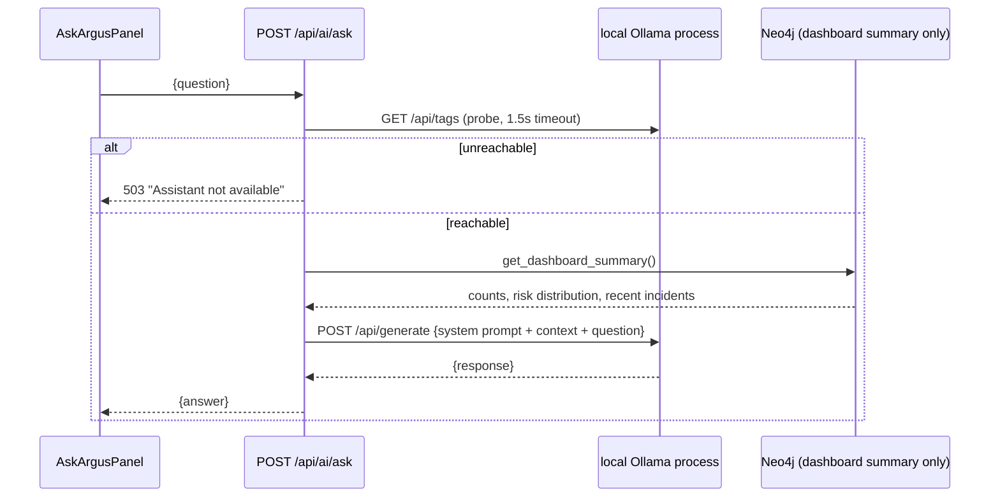

# Local Intelligence & Optional AI Layer

Scope: the two features that produce natural-language output — deterministic template narratives (always on, no dependency) and the optional local-LLM assistant (off unless the user runs Ollama themselves). This is the one area of the codebase where the project's [no-hosted-AI architectural constraint](architecture.md#local-first--no-hosted-ai-dependency) is most directly visible — read that section first if you haven't.

## Design principle

Everything under `backend/app/services/` that looks like "AI" is graded against one question: *could this be done with a graph algorithm, a classical ML model, or a rule-based/template system first?* Only genuinely open-ended natural-language Q&A (the "Ask ARGUS" assistant) reaches for an LLM at all, and even then it's local-only, optional, and probed at runtime rather than required.

## Deterministic narrative composition — `app/services/narrative.py`

No network call, no model, no dependency beyond the Python standard library. Every sentence a narrative produces maps 1:1 to a fact already sitting in the graph: queried properties, risk factors the generator's rule-based scorer already computed, and connection counts from a single Cypher query.

### Entity narratives

`compose_entity_narrative(label, name, properties, connections)` builds up to four sentences:

1. **Bio sentence** — for a `Person`: age (computed from `dob`), occupation, city/state. For an `Organization`: industry, registered city/state. Other labels get a generic "is a {label} entity" sentence.
2. **Risk sentence** — `"Risk score: {score}/100 ({band})."` where band is `critical` (≥80) / `high` (≥60) / `moderate` (≥35) / `low`.
3. **Risk factors sentence** — cites up to 4 of the entity's `risk_factors` (as written by `generator/generators/risk_scorer.py`), pluralized correctly ("The risk assessment cites: ..." for one factor, "cites N factors: ..." for more than one).
4. **Connections sentence** — "{name} is directly connected to N accounts, M devices, ..." — built from the same `get_connection_summary` query the Entity Profile page's sidebar uses, with correct singular/plural nouns via `CONNECTION_LABEL_NOUNS`.

### Case narratives

`compose_case_narrative(case, linked_entities)` — status/priority sentence, an evidence-board summary grouped by entity label, and the analyst's free-text notes verbatim if present.

### Endpoints

`POST /api/ai/entity-summary/{entity_id}` and `POST /api/ai/case-summary/{case_id}` (`app/api/routes/ai.py`) call these composers directly — no job/polling pattern needed since composition is sub-millisecond. Both are marked `POST` (not `GET`) because they're treated as an explicit "generate" action in the UI (a button click), not an implicit fetch, even though they're read-only and idempotent.

## Optional local-LLM assistant — `app/services/ollama.py`

"Ask ARGUS" is the **only** place an LLM appears anywhere in ARGUS, and it talks exclusively to a **local** Ollama instance (`https://ollama.com`) that the user must install and run themselves — never a hosted API.

### Availability probe

`is_available()` does a 1.5-second-timeout `GET {ollama_base_url}/api/tags` and returns `True` only on a 200 response, catching every `httpx` connection/timeout error as `False`. This is called at request time (`GET /api/ai/assistant-status`), never at backend startup — the backend starts and runs fully whether or not Ollama exists on the machine.

### Context assembly, not NL-to-Cypher

The original design sketch considered letting the model generate arbitrary Cypher from a natural-language question. This was deliberately **not** built: letting an LLM construct and run graph queries against a live database is a real prompt-injection and correctness risk, disproportionate to what a portfolio demo needs. Instead, `_build_context(driver)` calls the same `dashboard_repo.get_dashboard_summary` the Dashboard page uses, formats it as plain text (total counts, risk distribution, recent incidents), and that's the *entire* context window the model sees. The model is instructed (via `SYSTEM_PROMPT`) to answer only from that context and say so plainly if the answer isn't in it. The model never touches the database — the same safety principle as a NL-to-Cypher approach, with far less surface area.

### Request flow

`POST /api/ai/ask` (`app/api/routes/ai.py`): checks `is_available()` first — 503 with a clear message if not. Otherwise `ollama.ask(driver, question)` builds the context, sends `{model: "llama3.2:3b", prompt: SYSTEM_PROMPT + CONTEXT + question, stream: false}` to `{ollama_base_url}/api/generate`, and returns the model's `response` field verbatim.

### Frontend behavior when absent

`frontend/src/hooks/useAssistant.ts`'s `useAssistantStatus()` polls `/api/ai/assistant-status`; `frontend/src/components/assistant/AskArgusPanel.tsx` renders **nothing at all** — not a disabled button, not a placeholder — if `available` is false. The `⌘J` keyboard shortcut that opens it is also only wired up when `status?.available` is true. Every other page in the app is completely unaffected by Ollama's presence or absence; this is the only React component with a runtime dependency on it.

## Replacing or extending the LLM

`MODEL = "llama3.2:3b"` and the Ollama HTTP contract are the only two things tying `ollama.py` to that specific runtime. To point at a different local model: change `MODEL` and/or `ollama_base_url` (see [deployment.md](deployment.md#environment-variables)) — any server implementing Ollama's `/api/tags` and `/api/generate` contract works without further code changes. To add a genuinely new AI-adjacent feature, first apply the design principle above: if it can be a graph algorithm or a classical model trained on ARGUS's own data, do that instead (see [analytics.md](analytics.md) for the existing pattern), and only extend `ollama.py`'s context-assembly approach if the task is truly open-ended natural language.
