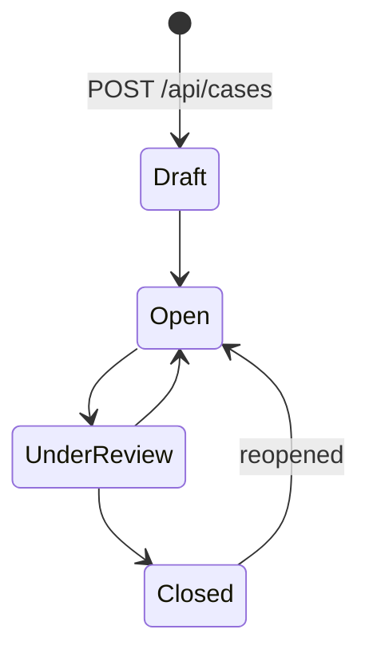

# Graph Analytics & Investigation Workflow

Scope: what every analytics algorithm computes, how results map back to investigations, and how Cases/Alerts move through their lifecycle. For endpoint contracts see [api.md](api.md); for the local-intelligence narrative/assistant layer see [ai-layer.md](ai-layer.md); for the Neo4j schema these algorithms run over, see [database.md](database.md).

All analytics runs are async background jobs (`app/api/routes/analytics.py`, `app/repositories/analytics_repo.py`) — see [backend.md#background-jobs](backend.md#background-jobs) for the polling contract common to all of them.

## Why an Account/TRANSACTED_WITH projection

Because transactions are edge properties rather than nodes (see [architecture.md](architecture.md#why-transactionscommunications-are-edge-properties-not-nodes)), `Account --TRANSACTED_WITH--> Account` *is* the money-movement graph directly — exactly the shape PageRank, Betweenness, Louvain, Node2Vec, and cycle detection need, with no extra traversal hops to reach the "real" transaction data.

`analytics_repo.ensure_projection` (re)creates a named GDS in-memory graph projection (`PROJECTION_NAME = "entityGraph"`) over `Account` nodes and `TRANSACTED_WITH` relationships, weighted by `amount`. It's idempotent — drop-and-recreate every call rather than tracking staleness, which is cheap enough at this scale (~2.8K accounts / 40K transactions) to not be worth the complexity of cache invalidation.

Every algorithm result is joined back from an anonymous Account UUID to its owning Person/Organization via `owner_lookup(driver, account_ids)`, which resolves `Account.owner_id` to the owner's human ID, display name, and label in one query.

## PageRank

`analytics_repo.run_pagerank` — `gds.pageRank.stream`, weighted by transaction `amount`. Surfaces globally influential entities: accounts whose transaction volume is amplified by being connected to other high-volume accounts, not just high-volume in isolation. Result: ranked list of `{id, name, label, account_id, score}`.

## Betweenness Centrality

`analytics_repo.run_betweenness` — `gds.betweenness.stream`, unweighted. Surfaces bridge entities: accounts that sit on a disproportionate number of shortest paths between other accounts — the "if this node were removed, the network would fragment" score. High betweenness with modest PageRank is a classic broker/intermediary signature.

## Louvain Communities

`analytics_repo.run_louvain` — `gds.louvain.stream` partitions the transaction network into densely-connected clusters. Each community is summarized as `{community_id, size, avg_risk_score, top_entity}` and the list is ranked by average risk, so an analyst can jump straight to the highest-risk cluster rather than scanning all of them.

## Node2Vec Similarity

`analytics_repo.run_node2vec_similarity(driver, seed_human_id, top_k)` — `gds.node2vec.stream` (embedding dimension 64, 5 iterations) computes a structural embedding for every account, then the seed entity's nearest neighbors are found by cosine similarity (`_cosine_similarity`, computed in Python over the streamed embeddings — GDS doesn't need to do the ranking). This finds entities playing a *structurally* similar role in the transaction network (similar neighborhood shape), not entities that are directly connected to the seed.

## Risk Propagation

`analytics_repo.run_risk_propagation(driver, seed_ids, max_hops=3)` — a custom hop-decayed spread, deliberately implemented as plain Cypher + Python rather than a GDS algorithm, so the reasoning is fully auditable: "why did this entity's propagated risk go up" always traces to a specific path from a specific seed.

Algorithm: starting from the seed entities' own risk scores, at each hop every reachable neighbor (across *any* relationship type, restricted to Person/Organization/Account/Device/Vehicle) accumulates `source_risk * (1 / hop) * EDGE_CONFIDENCE` (`EDGE_CONFIDENCE = 0.6`), so risk attenuates both by distance and by a flat confidence discount per hop. A node visited at multiple hops or from multiple seeds accumulates the sum of all contributions, capped at 100 for display. Result: `{seeds: [...], propagated: [{id, name, label, propagated_risk}]}`, sorted descending.

This is distinct from the generator's own one-hop `risk_scorer.py` pass (see [generator.md](generator.md#risk-scoring-risk_scorerpy)) — that runs once at world-build time as ground-truth seeding; this runs on demand, live, from any analyst-chosen seed, over whatever the graph currently looks like (including scenario-injected entities).

## Cycle Detection

`analytics_repo.run_cycle_detection(driver, min_length=3, max_length=6, limit=25)` — finds circular money-movement paths (`A → B → ... → A`) in the transaction graph, restricted to paths containing at least one flagged transaction (scoped to where real injected storylines live, rather than searching the full unbounded graph). This is the classic layering/laundering-ring signature. Bounded by path length and result count because cycle enumeration is combinatorially expensive. Result: list of `{length, total_amount, members}`.

## Transaction Anomaly Detection

`app/services/anomaly.py::detect_transaction_anomalies` — a genuinely independent detection pass, not a restatement of the generator's ground truth: it never reads the `flagged`/`storyline_id` properties the generator wrote. Instead it engineers three behavioral features per account directly from raw transaction timestamps/amounts (`tx_count`, `total_amount`, `max_burst_count` — the largest number of transactions falling within any 6-hour sliding window, computed by `_max_burst_count`, an O(n) two-pointer scan over sorted timestamps), then scores outliers two independent ways:

1. **Isolation Forest** (`sklearn.ensemble.IsolationForest`, `n_estimators=200`, `contamination="auto"`) — unsupervised, trained fresh on this world's own feature matrix every run. No pretrained weights, no external dataset.
2. **Z-score** against the account population's burst-count distribution — a fully explainable, auditable cross-check (`burst_baseline_mean`, `burst_baseline_std` are returned alongside every flagged account so the number is never a black box).

An account is only flagged when **both** methods agree (Isolation Forest says outlier *and* z-score ≥ 3.0). This produces a real (if small-scale) precision/recall story rather than a guaranteed match to the generator's labels — verified live during development: it independently rediscovered a real injected transaction burst (35 transactions in 6 hours, z≈37σ) purely from statistical shape, without ever reading the `flagged` field.

### Relationship to ground truth

The generator's storyline injector (`storyline_generator.py`) writes `flagged: true` and a `storyline_id` onto the transactions/communications it plants — this is **ground truth**, documenting what was deliberately planted, for evaluation purposes. Two backend features consume the graph *without* reading these fields, as genuine detection:

- The Isolation Forest + z-score anomaly detector (above).
- Cycle detection (above) *does* filter on `flagged = true`, but only as a search-space narrowing heuristic (real laundering rings in this synthetic world are exactly where storylines planted them) — the structural cycle itself is discovered by the traversal, not asserted.

## Case & Alert Workflow

### Cases

A `Case` (`app/repositories/case_repo.py`) is an investigation container: `title`, `status` (`Draft → Open → UnderReview → Closed`), `priority` (`Low|Medium|High|Critical`), `assigned_analyst`, free-text `notes`, and an evidence board of linked entities.

Status/priority/notes/analyst are updated via `PUT /api/cases/{case_id}` (partial update — only non-null fields in the request body are applied). Entities are attached/detached via `POST`/`DELETE /api/cases/{case_id}/entities` — this `MERGE`s or deletes a `LINKED_TO` relationship, the only relationship type the running application creates at request time (every other edge is generator-written). The generator also seeds a handful of cases directly from storylines at world-build time (`case_generator.generate_seed_cases`) so `/cases` has real data before an analyst manually opens anything.

### Alerts

There is no separate `Alert` node — `app/repositories/alert_repo.py`'s module docstring states this explicitly: alerts are a filtered view over `Incident` nodes with `severity IN ('High', 'Critical')`. The generator (or a storyline handler) creates the `Incident` when it plants a storyline; an analyst reviews it via `PUT /api/alerts/{alert_id}/review`, which sets `Incident.status` directly (`Open → UnderInvestigation → Closed`, reversible). This keeps "the alert" and "the incident record" as the same node — there's no secondary write path that could fall out of sync.

### Where analytics results feed investigations

Every analytics result row that names an entity links to `/entities/{id}` in the UI, and from there an analyst can add that entity straight to a case's evidence board. High-risk Louvain communities, cycle-detection members, and risk-propagation results are the primary "here's who to investigate next" surfaces the Analytics Engine produces — see `frontend/src/app/analytics/page.tsx`.
