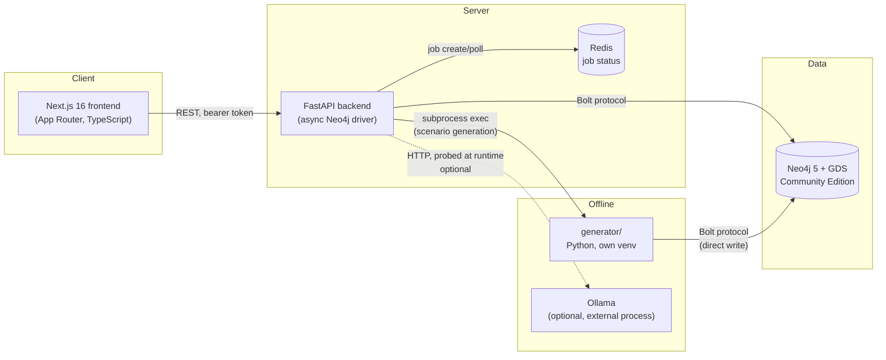
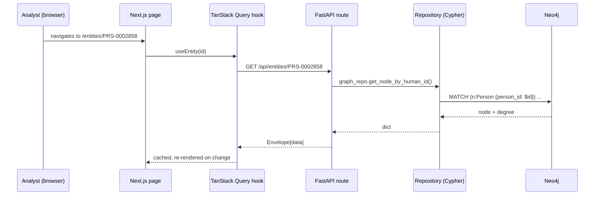
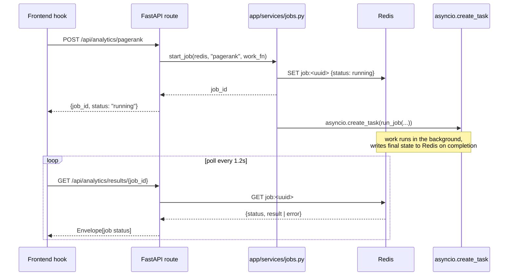

# Architecture

Scope: system-level view of ARGUS — the three deployables, how they talk to each other, and the decisions that shaped the shape of the system. For subsystem detail, see [backend.md](backend.md), [frontend.md](frontend.md), [generator.md](generator.md), [database.md](database.md).

## System boundaries

ARGUS is three independently deployable components sharing one Neo4j graph:

- **`frontend/`** — Next.js 16 App Router app. Never talks to Neo4j or Redis directly; every read/write goes through the FastAPI REST API.
- **`backend/`** — FastAPI app. Owns the only Neo4j and Redis connections in the running system. Stateless itself — all state lives in Neo4j (graph data) and Redis (ephemeral job status).
- **`generator/`** — a separate Python project with its own virtualenv, dependencies (`faker`, `neo4j`), and entry points. Writes directly to Neo4j over Bolt. Run standalone for full-world generation (`generate_world.py`) or invoked by the backend as a subprocess for on-demand scenario injection (`generate_scenario.py`).
- **Neo4j** — the single source of truth. Community Edition + the Graph Data Science (GDS) plugin, self-hosted via Docker Compose.
- **Redis** — not a cache in the traditional sense; it exists solely to hold the state of in-flight background jobs (analytics runs, scenario generation) so the frontend can poll a job by ID across requests.
- **Ollama** — entirely optional, external, probed at runtime. See [ai-layer.md](ai-layer.md).

## Why three separate deployables instead of one

The generator and the backend could have shared a Python package, but they are deliberately kept separate (`backend/pyproject.toml` vs. a plain `requirements.txt` in `generator/`, different virtualenvs):

- The generator is a batch tool: run once to seed a world, or run on demand to inject a scenario. It has no HTTP surface and no request-time latency budget.
- The backend is a long-running service with different dependency needs (FastAPI, Redis client, scikit-learn) and different lifecycle concerns (startup/shutdown of pooled connections).
- Keeping them separate means the backend's dependency graph never has to accommodate `faker`, and the generator's never has to accommodate `fastapi`.

The consequence: `backend/app/repositories/entity_labels.py` duplicates the ID-prefix-to-label mapping that also lives implicitly in `generator/generators/neo4j_writer.py`'s `NODE_SPECS`. This is an intentional duplication, not an oversight — see the docstring in `entity_labels.py`.

## Request flow: a typical read

Every backend response is wrapped in the same `Envelope[T]` shape (`data`, `meta`, `error`) — see [api.md](api.md#envelope-shape).

## Request flow: a long-running job (analytics, scenario generation)

Any operation too slow for a synchronous request/response (a GDS algorithm over the whole account graph, or spawning the generator as a subprocess) follows the same three-step contract everywhere in the codebase:

This pattern is implemented once, in `backend/app/services/jobs.py`, and reused by analytics (`analytics.py`), anomaly detection, and scenario generation (`scenario.py`). See [backend.md#background-jobs](backend.md#background-jobs).

## Why in-process asyncio jobs instead of a task queue (Celery/ARQ)

At this project's scale (single machine, jobs complete in low single-digit seconds), a dedicated always-running worker process is overhead without payoff. `asyncio.create_task` inside the same FastAPI process, with Redis only for status (not as a message broker), is simpler to run and reason about. This is a deliberate scope decision, not an oversight — a real multi-user production system would need a proper queue (worker crash recovery, retries, horizontal scaling), and that tradeoff is intentionally out of scope for a single-analyst local-first tool. See [deployment.md](deployment.md) for what would need to change to run this multi-tenant.

## Why transactions/communications are edge properties, not nodes

`Transaction` and `Communication` are not Neo4j node labels. They are properties on `TRANSACTED_WITH` (Account→Account) and `COMMUNICATED_WITH` (Device→Device) relationships. This is the single most consequential data-modeling decision in the system:

- At ~40K transactions and ~15K communications, modeling them as intermediate nodes would add tens of thousands of nodes and double the hop-count for every traversal that touches them, for no query benefit — every property survives identically on the edge.
- The algorithms that actually consume this data (PageRank, Betweenness, Louvain, cycle detection, risk propagation) all want an Account→Account or Device→Device weighted graph directly. Edge properties are exactly that graph, natively.

See [database.md](database.md) for the full schema this produces and [generator.md](generator.md) for how it's written.

## Local-first / no hosted-AI dependency

This is an explicit, hard architectural constraint, not a style preference: **ARGUS Core has zero dependency on any hosted AI API** (OpenAI, Anthropic, Gemini, Grok, Perplexity, or any other externally hosted LLM). Every feature that looks like "intelligence" — risk scoring, anomaly detection, narrative summaries, similarity search, community detection — is either:

1. A graph algorithm (Neo4j GDS: PageRank, Betweenness, Louvain, Node2Vec) or a custom Cypher traversal (risk propagation, cycle detection), or
2. A classical ML model trained fresh, at request time, on ARGUS's own synthetic data (scikit-learn Isolation Forest — no external dataset, no pretrained weights), or
3. A deterministic, template-based text composer (Python f-strings over queried facts — no model at all).

The **only** place an LLM appears anywhere in the system is the optional "Ask ARGUS" assistant, which talks to a **local** Ollama instance the user must run themselves, is probed at runtime (never required at startup), and degrades to simply not rendering its UI if unreachable. See [ai-layer.md](ai-layer.md) for the full design and rationale.

## Design system

Frontend is vanilla CSS Modules (no Tailwind/component library) — a hand-built dark-mode-first design system (fixed dark theme, no light mode planned; see `frontend/src/app/settings/page.tsx`'s Appearance tab). Motion is Framer Motion, applied selectively (stat counters, panel transitions), not globally.

## Cross-references

- [backend.md](backend.md) — FastAPI structure, services, background jobs
- [frontend.md](frontend.md) — Next.js routes, hooks, state management
- [database.md](database.md) — Neo4j schema, labels, relationships, indexes
- [api.md](api.md) — every endpoint
- [generator.md](generator.md) — synthetic world + scenario generation
- [analytics.md](analytics.md) — graph algorithms, anomaly detection, case/alert workflow
- [ai-layer.md](ai-layer.md) — narrative NLG + optional Ollama assistant
- [deployment.md](deployment.md) — running locally, Docker, configuration
- [troubleshooting.md](troubleshooting.md) — common failure modes
