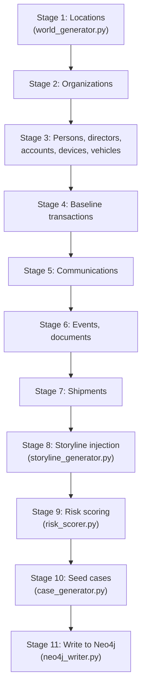

# Synthetic Data Generator

Scope: how the synthetic world is built and how new scenarios get injected into a live graph. For the schema this produces, see [database.md](database.md). For how the backend triggers scenario generation, see [backend.md](backend.md#background-jobs) and [api.md](api.md#scenario--appapiroutesscenariopy).

`generator/` is a standalone Python project — its own virtualenv, its own dependency list (`faker>=30.0`, `neo4j>=5.24`; no `requirements.txt`/`pyproject.toml` beyond that pair, see `generator/requirements.txt`). It never imports from `backend/`. It writes directly to Neo4j over Bolt using the synchronous `neo4j.GraphDatabase` driver (not the async one the backend uses — there's no request to serve concurrently, so a blocking driver is simpler).

Two entry points:

- **`generate_world.py`** — builds an entire world from scratch and wipes/writes it. Run manually, once, to seed (or reset) the database.
- **`generate_scenario.py`** — additively injects one new storyline into an already-running world. Run standalone for testing, or invoked by the backend as a subprocess from the Scenario Generator UI.

## Deterministic generation

Every run is seeded (`--seed`, default 42). The same seed always produces the same world: `random.Random(seed)` drives every generator module, and `Faker("en_IN").seed_instance(seed)` seeds the name/phone-number generator. This is what makes the default world reproducible across machines and across regenerations.

## World generation pipeline (`generate_world.py::build_world`)

Eleven stages, run in order because later stages depend on IDs/objects produced earlier:



Each stage is a plain function call wrapped in a `step(label)` decorator that times it and logs a checkmark — see `generate_world.py`'s `step()`. `main()` prints a summary of entity counts, then opens one `GraphDatabase.driver` connection and calls `write_world`.

## Scale configuration

`generator/config.py`'s `ScaleConfig` (a frozen dataclass) holds every entity-count knob:

```python
person_count: int = 4_000
org_count: int = 400
location_count: int = 600
vehicle_count: int = 900
device_count: int = 1_500
account_count: int = 2_800
transaction_count: int = 40_000
event_count: int = 6_000
communication_count: int = 15_000
shipment_count: int = 1_200
document_count: int = 2_000
storyline_count: int = 15
```

There is no CLI flag to override these individually — to change scale, edit `ScaleConfig`'s defaults directly (or construct a `GeneratorConfig(scale=ScaleConfig(...))` if calling `build_world` from other code). `--seed`, `--neo4j-uri/--neo4j-user/--neo4j-password`, and `--no-wipe` are the only CLI-exposed flags.

`config.py` holds the synthetic reference data — bank, telecom and carrier name pools (grouped by region), industry and occupation lists, document types. The **geography itself lives in `geography.py`**: 70 real cities across 50 countries and 10 regions, each with real coordinates, an activity weight, and functional tags (`port`, `financial`, `hub`). No real personal data is used anywhere; only place names and coordinates are real, which is what grounds synthetic entities in plausible geography.

South Asia — and India within it — carries the heaviest weighting by design. It is the product's declared **area of interest**, not the whole world model; roughly 29% of persons are placed there, with the remainder spread across the other nine regions. The world was previously ten Indian cities, which meant no amount of frontend work could produce a global operating picture.

`geography.py` also defines the two structures that give shipments meaning:

- **`TRADE_LANES`** — weighted region-to-region corridors (East Asia ↔ Europe, South Asia ↔ Middle East, ...). Shipments are routed along these rather than between two randomly chosen ports. This baseline is what makes an anomaly mean anything: with uniformly random endpoints, no route can be more surprising than any other.
- **`IMPLAUSIBLE_LANES`** — region pairs with essentially no direct freight relationship. A shipment routed along one of these is what "off-lane" means in this dataset, defined against the baseline rather than asserted by a flag.

## Entity generation — regional patterns

Every generator module lives in `generator/generators/` and follows the same shape: `generate_x(rng, ..., count, id_offset=0) -> list[dict]`.

- **Persons** (`person_generator.py`) — names come from a Faker locale matching the entity's **region** (`REGION_LOCALES`), so a person registered in Rotterdam or Busan isn't given an Indian name. Age 18–75, occupation from a fixed list, city/state/country/region from the weighted city list. Phone numbers are synthesised under the country's real dialing code rather than via Faker, whose `phone_number` provider is missing on several of the locales used here and wouldn't carry a country code anyway. ~12% are expatriates, taking their nationality **and their name** from a different country of origin than their city of residence — deriving the name from the city instead produced people whose name silently contradicted the only nationality field an analyst could filter on.
- **Organizations** (`organization_generator.py`) — names combine a regional root (`NAME_ROOTS_BY_REGION`), an industry suffix, and the **real legal form of the country of registration** (`Pte Ltd` in Singapore, `GmbH` in Germany, `K.K.` in Japan, `S.A.` in Panama). Weighted org type: 65% Corporation, 10% Shell, 10% NGO, 8% Government, 7% Criminal.
- **Vehicles** (`vehicle_generator.py`) — real Indian makes/models (Tata Nexon, Mahindra Bolero, Maruti Suzuki Swift, ...), synthetic plates in the `SS00XX0000` state-code format (`MH`, `DL`, `KA`, ...). ~1 in 3 owners get a vehicle.
- **Accounts** (`account_generator.py`) — 1–4 per person, 1–3 per organization, drawn from a shuffled owner list until `target_count` is hit; type/balance-class are weighted categorical draws. Banks are drawn from the owner's own region, with a 14% offshore minority held at a bank **outside** it and marked `offshore: true` — a cross-border holding is exactly what an investigation looks for, so the deviation is a queryable property rather than something lost in a uniform bank pool.
- **Devices** (`device_generator.py`) — 1–3 per person, synthetic IMEI/MAC, carrier from a synthetic-telecom list.
- **Transactions** (`transaction_generator.py`) — per-account baseline volume is itself a weighted draw (`3, 8, 20, or 45` transactions, weighted toward the low end) so that a later injected burst reads as a genuine statistical deviation rather than blending into noise. Amount scales with the account's `balance_class`.
- **Communications** (`communication_generator.py`) — builds a contact graph first (5–15 contacts per connected person), then generates traffic along those edges — this is what makes the resulting graph look like a real social network instead of uniform random noise.
- **Documents, Events** — see their respective generator modules.
- **Shipments** (`shipment_generator.py`) — ~97% follow `TRADE_LANES`; the remaining ~3% deviate in one of three **inspectable kinds** rather than via a single opaque boolean, because each is a different analytic question with a different follow-up:

  | Kind | What it is | Recorded as |
  |---|---|---|
  | `off_lane` | Endpoints in two regions with no freight relationship | `origin_region`/`destination_region` in `IMPLAUSIBLE_LANES` |
  | `circuitous` | Plausible endpoints, implausible detour | `via_id` (a third-region port) + `detour_ratio` ≥ 1.4 |
  | `manifest_shift` | Declared cargo ≠ recorded cargo | `manifest` vs `declared_manifest` |

  Transit time scales with the **routed** distance (~500 km/day), so arrival dates stay consistent with the path actually drawn on the map.

## Storyline injection (`storyline_generator.py`)

Stage 8 plants deliberately-entangled entity clusters — **ground truth**, not detection. Seven storyline types, each a standalone handler function taking `(rng, world, result: StorylineResult, index)`:

| Type | What it plants |
|---|---|
| `shell_company_ring` | 3–8 organizations forcibly retyped as `Shell`, 1–3 shared controllers (`CONTROLS` edges), circular transaction routing between the ring's accounts (A→B→C→...→A, each hop retaining a small cut) |
| `money_routing_network` | A 4–7 account transaction chain, high value, each hop skimming a cut — classic layering |
| `communication_cluster` | 5–10 people with an unusually dense communication pattern over a 48-hour window |
| `supply_chain_divergence` | Marks 1–4 existing route-anomaly shipments as high-risk and bundles them into one storyline. The on-demand path (`generate_scenario.py`) sets `anomaly_kind` and a mismatched `declared_manifest` alongside `route_anomaly` — flipping the boolean alone produced flagged arcs whose map detail panel could give no reason for the flag |
| `document_forgery_ring` | 3–6 documents flagged with an inconsistency type (issuer/subject mismatch, duplicate serial, backdated issue) |
| `identity_overlap` | 1–2 additional people sharing a device with its registered owner (`SHARES_DEVICE`) |
| `anomalous_transaction_burst` | 15–50 transactions from one account in a 6-hour window, several times its baseline velocity |

Every storyline produces one `Storyline` record (severity, discovery difficulty, the human IDs of every entity/transaction/communication involved) and one `Incident` record (what an analyst would see as an alert). `inject_storylines` cycles through the seven handlers round-robin for `storyline_count` iterations (default 15, so a bit over 2 of each type).

## Risk scoring (`risk_scorer.py`)

Stage 9. Deterministic, rule-based, fully explainable — every point on every score traces to a specific fact:

1. **Storyline membership** — every entity named in a storyline's `entity_ids` gets bumped by a severity-weighted amount (`Critical` +40, `High` +28, `Medium` +16, `Low` +8), with the storyline recorded in `risk_factors`.
2. **Shell company registration** — any `Organization` with `type == "Shell"` gets +10.
3. **Flagged documents** — a person who is the subject of a forged/inconsistent document gets +15.
4. **One-hop propagation from organizations to directors/controllers** — `org.risk_score * 0.35 * edge.confidence`.
5. **One-hop propagation across shared devices** — the lower-risk person in a `SHARES_DEVICE` pair absorbs `higher.risk_score * 0.35`.
6. **Baseline noise** — untouched entities get a small random score (0–6) so nothing reads as suspiciously exactly `0.0`.
7. **Clamp** every score to `[0, 100]`.

This is the generator's *initial*, one-hop score. The interactive, multi-hop **Risk Propagation** algorithm analysts can trigger from any seed node in the Analytics Engine is a separate, on-demand backend feature that runs live against the full current graph — see [analytics.md](analytics.md#risk-propagation).

## On-demand scenario generation

`generate_scenario.py` is the module covered in this section.

Additively injects **one** new, self-contained storyline into the *live* graph, reusing the exact same generator functions and storyline handlers as the full world build — this runs the real generation engine, not a simulated progress bar.

### ID offsets

Every entity generator function accepts `id_offset: int = 0` (default preserves the original full-world-generation call sites). Before building a scenario, `_fetch_offsets(session)` queries Neo4j for the current maximum numeric suffix of every ID prefix (`MAX(n.org_id)`, etc. — or, for `TXN`/`COM` which have no node label, `MAX(r.tx_id)` over the relevant relationship type) and passes that forward as `id_offset`, so newly-generated IDs continue the existing sequence and can never collide.

### Reusing existing persons

`_fetch_existing_persons(session, count)` pulls `count` existing `Person` nodes with `risk_score < 40`, ordered randomly, straight from the live graph. These are matched by `uuid` and referenced, **never re-created** — `write_scenario` (see below) skips the `Person` node-write step entirely for this reason. This is what lets a scenario "just work" against whatever world is currently loaded, without knowing anything about how that world was generated.

### Complexity scaling

```python
COMPLEXITY_SCALE = {
    "Low":    {"orgs": 3,  "persons": 6,  "shipments": 4},
    "Medium": {"orgs": 6,  "persons": 12, "shipments": 8},
    "High":   {"orgs": 10, "persons": 20, "shipments": 14},
}
```

### Orchestration (`build_scenario`)

1. Fetch ID offsets, existing persons, and (for `supply_chain_divergence` only) existing locations.
2. Depending on `scenario_type`, generate just the new entities that storyline needs (organizations for `shell_company_ring`, accounts for `money_routing_network`, devices for `communication_cluster`/`identity_overlap`, documents for `document_forgery_ring`, shipments for `supply_chain_divergence`) — see two scoping fixes below.
3. Call the matching storyline handler from `HANDLERS` (imported directly from `storyline_generator.py` — the private `_shell_company_ring` etc. functions are reused as-is, not reimplemented).
4. Run `risk_scorer.score_world` over just the new entities.
5. Seed one `Case` via `case_generator.generate_seed_cases`.
6. Write everything with `neo4j_writer.write_scenario` (additive-only — see [database.md](database.md)).
7. Return a JSON summary: storyline id/type/severity/description, the seeded case ID, a "key entity" to jump to, and per-label node counts.

Two scoping fixes exist here because a small on-demand batch doesn't naturally reproduce the full-world statistical distribution the storyline handlers assume:

- `shell_company_ring` forces every newly-generated organization's `type` to `Corporation`/`Shell` (the handler only draws from those two types, and a batch of 3–10 fresh orgs at the natural ~65/10% split isn't guaranteed to produce enough Shells).
- The matching account-generation call passes `target_count = len(orgs) * 3` — the per-owner maximum — so every new organization is guaranteed at least one account before generation stops early.

### The STAGE: / RESULT_JSON: protocol

`generate_scenario.py` communicates with its caller entirely through stdout, one line at a time:

```
STAGE: Selected 12 existing persons
STAGE: Organizations created (6)
STAGE: Accounts created (14)
STAGE: Building graph relationships...
STAGE: Writing to graph...
RESULT_JSON: {"storyline_id": "STL-0000016", "type": "shell_company_ring", ...}
```

`log_stage(message)` prints `STAGE: {message}` and flushes immediately. `main()` prints exactly one final `RESULT_JSON: {...}` line — either the summary dict on success, or `{"error": str(exc)}` with a non-zero exit code on failure.

The backend's `app/services/scenario.py::_run` spawns this script via `asyncio.create_subprocess_exec`, using `generator/.venv/bin/python3` directly (not a shell), reads stdout line-by-line, forwards every `STAGE:` line into `jobs.update_job_progress` (so the frontend can render live progress), and parses the final `RESULT_JSON:` line as the job's result. See [backend.md](backend.md#background-jobs).

## Running the generator standalone

```bash
cd generator
python3 -m venv .venv && source .venv/bin/activate
pip install -r requirements.txt

python3 generate_world.py --seed 42                 # full rebuild (wipes existing graph)
python3 generate_world.py --seed 42 --no-wipe        # additive, same as write_world(wipe_existing=False)

python3 generate_scenario.py --type shell_company_ring --complexity Medium --seed 123
```

Both scripts accept `--neo4j-uri`, `--neo4j-user`, `--neo4j-password` (defaulting to the docker-compose values). Keep `generator/.venv` in place even after initial world generation — the backend's Scenario Generator feature depends on that exact virtualenv path existing (`GENERATOR_PYTHON = generator/.venv/bin/python3`, hardcoded in `app/services/scenario.py`).
